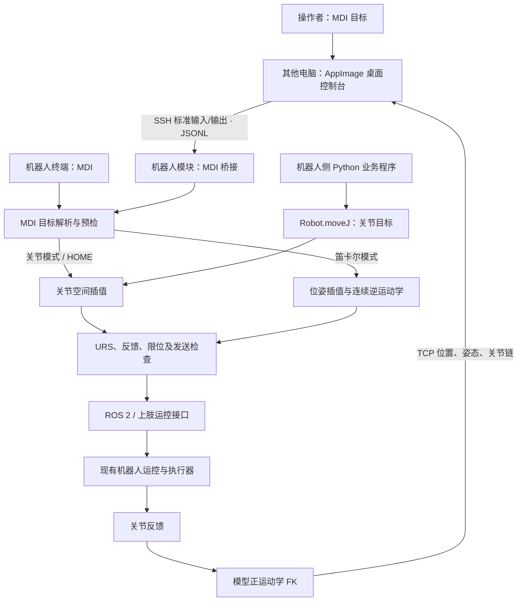

# X2 双臂运动控制模块 V2.1：项目介绍与技术原理

X2 双臂运动控制模块面向机器人上肢调试和业务集成，将人工调试与程序调用统一到同一套模型、运动生成和反馈检查流程。项目提供两个公开入口：操作者通过 **MDI** 输入目标并观察双臂状态；业务程序通过 **Python `Robot.moveJ()`** 下发七关节目标。机器人侧以独立 Python 模块部署，其他电脑可使用 Linux AppImage 桌面控制台连接。

**使用前提：仅在机器人已经处于 URS（`UPPERBODY_REMOTE_SPLIT`）模式下支持运动。客户须使用机器人原有操作工具自行切换到 URS。MDI 和 MoveJ 均不带模式切换功能，不自动进入或恢复 URS。**

产品显示版本为 V2.1，机器人模块版本为 `2.1.1`，桌面客户端版本为 `2.1.0`，源码工作分支为 `V2.0`。

本说明用于客户技术交流与集成评估。操作步骤、参数详情分别见[模块指南](MODULE_GUIDE.md)、[桌面 MDI 指南](DESKTOP_MDI_GUIDE.md)、[坐标说明](COORDINATES.md)和[TCP 标定指南](TCP_CALIBRATION_GUIDE.md)。

## 1. 项目解决什么问题

上肢调试通常需要在“关节角目标”和“末端位置姿态目标”之间转换，同时确认当前反馈、机器人模式和执行结果。项目把这些能力组织为可部署模块，减少业务侧直接处理运动学、消息格式和双臂通路的工作。

| 使用者 | 输入与操作 | 获得的能力 |
| --- | --- | --- |
| 现场调试人员 | 选择手臂，输入关节角、位置或姿态，预检后显式下发 | MDI 调试、双臂 HOME、实时数值与 3D 双臂模型反馈 |
| 业务开发者 | Python 中给出单臂或双臂七关节目标 | 顺序阻塞的 MoveJ 调用、结束反馈与关节误差 |
| 集成维护者 | 核对当前机器的模型，准备 ROS/AimDK 环境和部署配置 | 独立部署、版本校验、接口与运行环境分离 |

项目处理上肢到点与运动学调试，不承担任务规划、感知识别、抓取策略或机器人整机状态管理。

## 2. 系统组成与数据流



桌面控制台负责输入、显示和操作授权；运动学与机器人控制在机器人模块内执行。桌面通过已有 SSH 服务启动模块，不增加网页、HTTP 或 WebSocket 服务端口。Python MoveJ 示例在机器人侧运行，不是远程 Python RPC 客户端。

机器人已有 ROS、AimDK 消息环境和运控仍是运行依赖。项目不替换底层运控，也不要求修改机器人原有 DDS 配置。

## 3. 对外接口

### 3.1 MDI：人工输入目标

MDI（Manual Data Input，手动数据输入）支持下列单条目标：

| 方式 | 目标含义 |
| --- | --- |
| `j` | 所选手臂七关节绝对角度 |
| `xyz` | torso 坐标系绝对位置，保持参考姿态 |
| `pose` | torso 坐标系绝对位置与姿态 |
| `d` | 沿 torso 坐标轴的平移增量 |
| `rpy` | torso 坐标系绝对姿态 |
| `R` | 绕 torso 固定轴的旋转增量 |
| `t` | 绕当前 TCP 自身轴的旋转增量 |
| HOME | 双臂回到模块定义的 HOME 关节姿态 |

桌面启动后由操作者连接，默认只读显示双臂状态。用户核对单位和目标，先预检，再显式启用发送、下发指令。预检验证目标数值、限位与逆解可行性；完整运动还需逐帧检查，预检通过不代表整段路径或环境无碰撞。

3D 视图显示真实连杆 STL 来源的简化网格、关节链、TCP 与方向轴，支持旋转、缩放和平移。
提供的模型目录中没有 STEP，当前使用 URDF 配套 STL 减面；旧反馈缺少连杆变换时可用注明来源的本地 FK，
非法变换或资源不可用时回退骨架。只显示双臂连杆，工具通过 TCP 点与方向轴表示，不显示手指或夹爪本体。
显示依据关节反馈的模型 FK，不是相机画面、外部定位结果或碰撞模型。左右按机器人自身定义；从正面面对机器人观察时，机器人左臂位于画面右侧。相机操作不改变运动目标。

MDI 仅显示当前运控模式，不提供模式切换。非 URS 时可保留反馈查看与桌面预检，但不能启用运动或 HOME。

### 3.2 MoveJ：Python 业务调用

```python
from x2ik import Robot, HOME

# 以下调用会实际运动，运行前须由客户自行将机器人切换到 URS。
with Robot(tcp_mode="gripper") as robot:
    result = robot.moveJ(HOME, side="right", duration=8, settle=2)
    print(result["err_max"])  # 结束时最大关节误差，单位 rad
```

| 需求 | 调用形式 |
| --- | --- |
| 右臂目标 | `robot.moveJ(q, side="right")` |
| 左臂目标 | `robot.moveJ(q, side="left")` |
| 双臂同步 | `robot.moveJ(q_left=q_left, q_right=q_right)` |

`q` 是七个关节角，单位 rad；运动时长和稳定时间单位 s。双臂通过同一个实例发送，采用相同的轨迹进度；先后调用两个单臂方法并不构成双臂同步。

接口顺序阻塞执行，返回单臂或双臂的关节反馈、误差等信息。方法返回后不在后台持续保持。关节目标已知时 MoveJ 不需要逐帧做逆运动学；它也不承诺 TCP 沿直线运动。最简示例默认只打印目标，显式追加 `--execute` 才实际运动。

## 4. 模型、坐标与正运动学

单臂由七个旋转关节构成：肩 pitch / roll / yaw、肘、腕 yaw / pitch / roll。左右侧分别使用对应模型与关节限位，不能用整组角度取负来代替另一侧模型。

关节几何、轴向及限位来自 URDF。正运动学 FK 将七关节角 `q` 映射到 TCP 位姿：

```text
T(q) = T₁(q₁) · T₂(q₂) · … · T₇(q₇) · T_tool
T(q) = [ R(q)  p(q) ]
       [   0     1  ]
```

这里 `p` 是位置，`R` 是旋转矩阵，`T_tool` 为完整腕到工具刚体变换。
V2.1 提供 `none / hand / gripper / custom`，默认 `none` 以对应侧 `wrist_roll_link` 为 TCP。
灵巧手预置腕系 `[0.035,0,-0.150] m` 的近似杯子中心；夹爪使用 `[0,0,-0.17608] m`
的 URDF 名义中心。两者都不是实测标定，不控制手指/夹爪开合，实际抓取依赖外部业务流程。
自定义模式可填写左右独立的平移及旋转，见 [TCP 标定指南](TCP_CALIBRATION_GUIDE.md)。

工具影响 MDI 目标解释、FK 与 MoveJ 返回的位姿，不改变 MoveJ 的 `q` 或 HOME 关节角。
灵巧手来源的整机几何与当前基础模型不同，因此仅提取工具定义，不替换手臂几何。

双臂共用 `torso_link` 坐标系：X 向机器人前方、Y 向机器人左方、Z 向上。这个坐标系随躯干转动。相机或世界坐标中的目标，需要先转换到 torso 坐标。

桌面关节角和姿态角使用 deg，位置输入支持 m/mm；Python MoveJ 使用 rad。RPY 姿态约定为 `R = Rz(RZ) · Ry(RY) · Rx(RX)`。

## 5. 逆运动学如何求解

### 5.1 为什么七轴手臂通常不只有一个解

逆运动学 IK 的任务是：给定期望 TCP 位置 `p*` 和姿态 `R*`，寻找满足目标的七关节角 `q`。

末端位姿通常提供六个独立约束，而单臂有七个关节。在非奇异且约束允许的区域，通常还剩一个冗余自由度：末端保持不动时，肘部仍可能改变朝向。因此求解不仅要“到达目标”，还要选择合适的肘姿态与解分支。

### 5.2 SRS 几何与 SEW 臂角

项目利用 X2 手臂近似 SRS 的结构：Spherical shoulder（近似球肩）、Revolute elbow（单轴肘）、Spherical wrist（近似球腕）。用肩心 S、肘位 E、腕心 W 构成的几何关系描述手臂。

理想几何中，固定肩心与腕心距离后，肘位置位于绕 S→W 轴的一条圆上。用 SEW（Shoulder–Elbow–Wrist）臂角 `ψ` 指定肘在这条圆上的位置：

```text
v = (W − S) / ‖W − S‖
E(ψ) = S + h·v + ρ·[cos(ψ)·n + sin(ψ)·b]
```

`n`、`b` 是垂直于 `v` 的两个基向量；`h` 是肘圆中心沿肩腕方向的距离，`ρ` 是肘圆半径。公式解释冗余参数的几何含义；实际求解使用模型中的轴向和安装偏移。

模型并非完全理想的 SRS，特别是腕轴非共点会引入解析近似误差。因此实现采用“解析生成候选 + 必要时局部数值精修”，不把理想结构假设当作任意七轴机器人的通用保证。

### 5.3 从目标位姿得到关节候选

单目标求解首先复核当前关节角，已满足位置和姿态目标时直接保留，给定种子时优先做六维局部精修，未得到合格解再进入解析搜索：

1. 根据目标位置、姿态和模型末端偏移计算目标腕心。
2. 利用肩腕距离与臂段几何求出可能的肘角。
3. 扫描或邻域搜索 `ψ`，得到对应肘位置与肩部旋转。
4. 分解肩部和腕部旋转，得到七关节候选。对一个固定 `ψ`，一般最多枚举 2 个肘分支 × 2 个肩分支 × 2 个腕分支。
5. 过滤关节越界候选，并综合与种子关节角的距离、限位裕度及奇异性惩罚选择候选。
6. 按完整 URDF 做 FK 复核，需要时数值精修，再检查最终限位与残差。

解析结果残差超标时增加不约束 SEW 的六维精修，仍无合格解时尝试有限组固定种子，所有返回解均要求模型内位置残差不超过 0.01 mm、姿态残差不超过 0.001°，固定种子与测试目标的生成关节角无关，有限次搜索不保证覆盖整个工作空间。

“最多八支”是固定臂角下的解析分支数量，不是七轴手臂对一个位姿最多只有八个解；不同 `ψ` 还可能形成连续的解集合。

### 5.4 数值精修与连续轨迹

数值精修采用 Levenberg–Marquardt 思路，把位置误差、旋转误差和 SEW 角误差组成残差 `e`，计算阻尼修正：

```text
(JᵀJ + λI) Δq = Jᵀe
q_next = q + Δq
```

`J` 包含位姿雅可比及臂角导数，`λ` 是阻尼。阻尼可抑制近奇异时的过大修正；实现只接受残差下降的试探步。该过程提高模型内的位姿一致性，不等同于辨识或消除实体机器人的装配误差，也不保证每个目标必然收敛。

单目标求解可以搜索较大的臂角范围，在线笛卡尔轨迹优先保持有效姿态或从上一帧做最多 12 次六维局部迭代，再尝试 SEW 邻域搜索，局部数值结果需反查解析分支，无法可靠对应或与上一帧分支不符时拒绝该结果，显式指定期望臂角时使用 SEW 搜索。

运动路径禁用全局后备搜索和固定备用种子，对实际有限位关节角检查 0.05 rad 单帧变化上限，目标始终使用原始位姿，不把工作空间投影点当成请求目标，连续五帧无合格解时停止推进，限位、分支、反馈和位姿残差检查不因局部求解而放宽。

这套 IK 主要由项目的模型几何计算和 NumPy 实现；公开入口封装的是 MDI/MoveJ，内部 IK 类型和方法不作为独立客户 API 承诺。

## 6. 从逆解到运动

MoveJ 在关节空间插值。对归一化时间 `s ∈ [0,1]`，采用五次时间比例：

```text
a(s) = 10s³ − 15s⁴ + 6s⁵
q(s) = q_start + a(s) · (q_target − q_start)
```

理论起止速度和加速度为零；到达时间结束后保持 `settle` 秒，再取得反馈。这个时间插值本身不等于带完整速度、加速度、力矩约束的动力学规划。

MDI 的笛卡尔运动在内部生成位置线段与旋转插值，再逐帧调用 IK：

```text
p(s) = p_start + a(s) · (p_target − p_start)
R(s) = R_start · Exp[a(s) · Log(R_startᵀ · R_target)]
```

即使终点有解，中间路径仍可能越限或靠近奇异，故需逐帧检查。当前运动实现按 50 Hz 目标节奏更新命令；这是实现的循环频率，不是任意系统负载下的硬实时保证。

MDI 和公开 MoveJ 内置 `40 N·m/rad / 12° / pelvis`：按每帧目标姿态和有效 pelvis IMU 重力方向
计算模型重力力矩，以 `Δq = clip(τ_g(q) / 40, ±12°)` 形成有界位置偏置，再检查下发关节限位。
固定的是参数，实际偏置随姿态与重力方向变化；不会修改机器人底层伺服刚度。
补偿依赖模型、重力估计和实际负载；开发验证中的可选尾部闭环也不等同于公开 MoveJ 的默认行为。

当前尚未提供经过可靠验证的自动标定流程，先统一采用上述工作参数，不读取或要求客户准备 SN 标定文件。
这不表示新机器已经完成实测标定，也不校正关节零位或装配几何。换机仍需核对型号、模型、反馈及有效 IMU，
并分别验证两臂；固定参数不构成外部 1 mm 定位保证。
V2.1 可公开选择工具或录入完整 TCP 外参，也提供已采集腕姿态的离线枢轴拟合；
枢轴只能估计平移，方向需另行测量。仍不提供自动运动采样、负载/重心配置或自动刚度辨识。
具体流程与现有工具限制见[模块指南：更换机器人与现场标定](MODULE_GUIDE.md#更换机器人与现场标定)。

## 7. 运行约束与精度口径

运行前检查当前 URS 状态、关节与所需 IMU 反馈、关节限位及命令发布独占等条件。桌面默认只读，启用发送需要明确操作；外部离开 URS 或状态过期会撤销发送授权，恢复后必须重新启用。MDI 会话可在运动后持续保持；MoveJ 方法返回后无后台保持。

桌面停止发送、断线或关闭不追加 HOME 或模式切换。终端在线 MDI 的 `q!` 直接停止退出，普通 `q` 会先执行双臂 HOME，具体操作见对应指南。应用停止发送不是机器人硬件急停；模块没有自碰撞或环境碰撞规划。

| 指标 | 测量的含义 | 不能据此直接推出 |
| --- | --- | --- |
| FK→IK→FK 残差 | 同一模型中的数学求解一致性 | 实体末端绝对定位精度 |
| 反馈 FK 位置误差 | 反馈关节角经模型计算的 TCP 与目标差 | 未建模的装配、工具及标定误差 |
| MoveJ `err_max` | 结束反馈与目标的最大关节角误差，rad | TCP 毫米误差 |
| 外部 TCP 实测误差 | 经外部测量得到的实际末端偏差 | 未测工作空间或工况的性能 |

本说明不作通用“1 mm 定位”承诺。具体精度、可达范围和响应能力应在客户的机器人、工具、配置和目标集上验收。换机器人或更换末端工具后，历史结果不能直接继承。

## 8. 交付与集成边界

| 交付内容 | 用途 |
| --- | --- |
| Python wheel / runtime 压缩包 | 两种机器人模块安装方式，任选一种 |
| Linux x86_64 AppImage | 操作者电脑上的 MDI 控制台；构建兼容信息见随包清单 |
| MDI / MoveJ 最简示例 | 接入和调用参考，默认不直接运动 |
| 使用说明、坐标文档与校验清单 | 核对接口语义、部署内容及版本 |
| TCP 配置示例和离线枢轴工具 | 填写工具外参，对人工采集数据拟合平移；不连接或运动 |

客户准备适配的 ROS/AimDK 环境、自己的 SSH 认证与现场配置，完成换机核验并自行切换至 URS。
客户入口使用内置固定补偿，无需准备 SN 补偿 JSON；选 `custom` TCP 时需要自己的工具 JSON。本项目交付不包含机器专用数据，也不修改现有 DDS 或其他机器人模块。

建议先阅读本介绍了解技术范围，再按[模块指南](MODULE_GUIDE.md)准备环境，使用[桌面指南](DESKTOP_MDI_GUIDE.md)或交付目录中的 `examples/movej_minimal.py` 完成接入。目标数值及外部坐标转换以[坐标文档](COORDINATES.md)为准。
